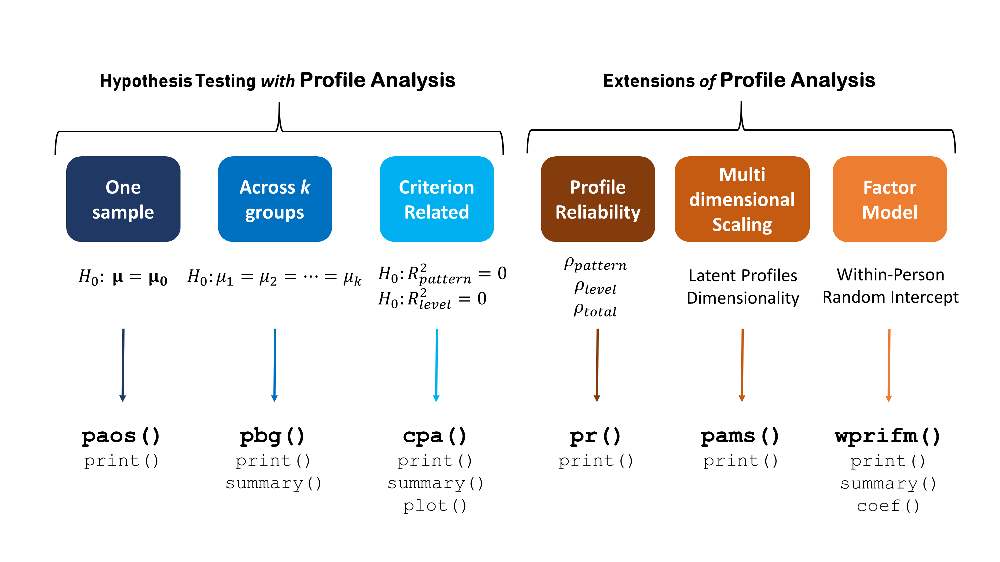

# Summary

A profile is a vector containing a person’s or group's scores from an assessment. An assessment, defined here as a series of items used to measure one or more traits, is administered in a variety of contexts. For example, schools administer high-stakes standardized assessments for accountability purposes and to measure student aptitude and progress; a young adult exhibiting compensatory and binge eating behaviors may complete a brief assessment to ascertain the likelihood of an underlying eating disorder; and human resources may recommend whether to hire an applicant based on a personality assessment. A student's, a young adult's, and an applicant's scores on these assessments make up their profile. 

 

Figure 1 shows the profiles of six random participants on an assessment of the five personality traits - agreeableness (A), conscientiousness (C), extraversion (E), neuroticism (N), and openness (O) [@psych]. Figure 1 shows that participant 975 had the highest average score across the five traits (23.6), while 710 had the lowest average score (16.4), that participants 273 and 710 and 392 and 975 share similar, potentially qualitatively important, patterns, and that participant 273's profile had the greatest variance (36.2), while participant 392's had the least (5.5). These features (i.e., level, pattern, and variability) in a profile often hold important clinical meaning and statistically assessing differences in these features is of importance to researchers, educators, and other practitioners.   

A suite of techniques, collectively known as **profile analysis**, can be used to analyze and classify profiles. These techniques come from a variety of statistical frameworks including repeated-measures MANOVA, multidimensional scaling and factor analysis, cluster analysis, and machine learning. Applying these disparate methods in R can be challenging for novice users and practitioners with limited statistical training as these techniques are either unavailable, require interfacing with a myriad of packages, or require understanding the relationship between a technique and a more general statistical modeling framework. The R package ``profileR`` was designed to address this need and can be installed by typing the following in R:

```r
install.packages("profileR")
```

or for the development version on GitHub

```r
devtools::install_github("cddesja/profileR")
```

The R package ``profileR``, currently in version 0.3-6 on the comprehensive R archive network (CRAN), implements profile reliability [@bulut2013between; @bulut2017], criterion-related profile analysis [@davison_identifying_2002], profile analysis via multidimensional scaling [@pams], moderated profile analysis, profile analysis by group, and a within-person factor model to derive score profiles [@davison2009factor] as well as a variety of graphical methods to visualize profiles. Related profile analysis packages exist in R, such as ``tidyLPA`` [@rosenberg2019tidylpa] and ``mclust`` [@mclust], as well as in Mplus [@muthen2004mplus], however, our approach does not rely on mixture modeling and aims to provide access to a wider range of profile analytic techniques.

The API for ``profileR`` was designed to provide a unified, consistent, and user-friendly R interface for these methods (see Figure 2). It uses the S3 class and many generics have been written to work with ``profileR`` objects. Any future statistical methods added to ``profileR`` will adhere to the existing API (such as the addition of Bayesian approaches and multilevel profile analysis). 



``profileR`` has been used in education, counseling, and to study learning behavior in mice. The package has been featured in a handbook on measurement and psychometrics in R [@desjardins2018handbook]; used in workshops and graduate level courses; is a part of the psychometric CRAN task view; and is downloaded, on average, 752 per month from CRAN.  Our focus on R novices and usability, should help to expand the reach of profile analysis into new scientific disciplines.


# References
